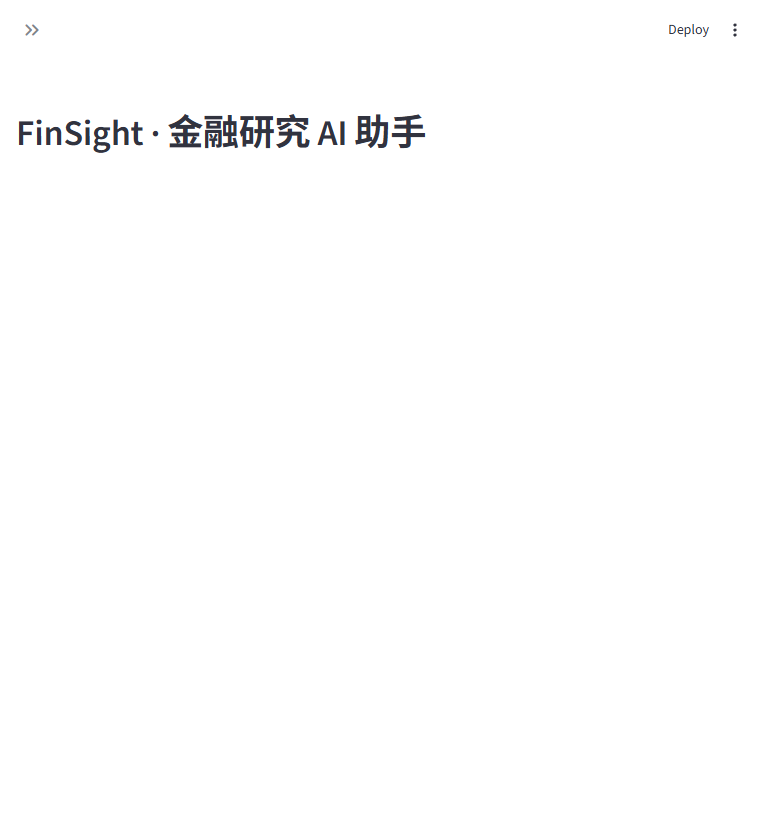
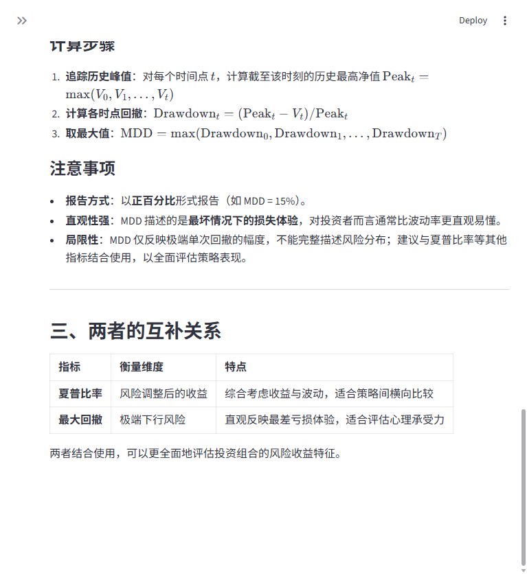
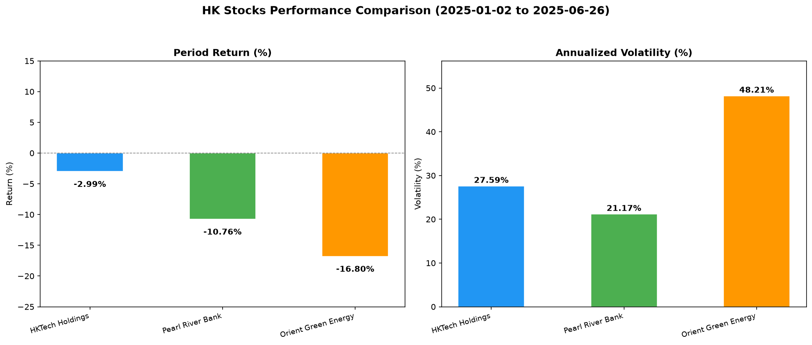
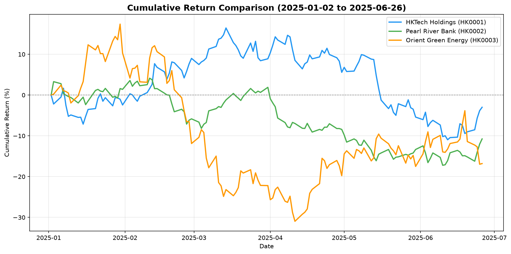

# FinSight Agent 📈

**A finance research assistant built with LangChain Deep Agents — combining RAG knowledge Q&A and sandboxed data analysis in one conversational interface.**

FinSight answers finance concept questions with citations from a local knowledge base, and performs real data analysis on stock market data by writing, executing and debugging Python code autonomously — then delivers charts and a markdown report back to the chat UI.

| Chat UI | Knowledge Q&A (RAG) |
|:---:|:---:|
|  |  |

| Agent-generated comparison chart | Agent-generated cumulative returns |
|:---:|:---:|
|  |  |

## Features

- **RAG knowledge Q&A** — indexes local finance knowledge (technical indicators, risk metrics, HK market basics) into a **Chroma persistent vector store**; retrieves, offloads chunks to the agent filesystem and delegates analysis to parallel subagents, then synthesizes a cited answer.
- **Autonomous data analysis** — for computation questions the agent plans with a todo list, writes a pandas/matplotlib script, runs it in a local sandbox, interprets the output and iterates on errors.
- **Artifact delivery** — charts (PNG) and reports (Markdown) are exported from the agent workspace and rendered/downloadable in the Streamlit UI.
- **Multi-turn memory** — LangGraph checkpointer keeps conversation context per thread; every conversation gets its own isolated workspace.
- **Two interfaces** — Streamlit web UI and a minimal CLI.

## Architecture

```
                          ┌─────────────────────────────────────────┐
                          │           FinSight Deep Agent           │
 User question            │  (planning via TodoListMiddleware)      │
      │                   └───────┬───────────────────┬─────────────┘
      ▼                           │                   │
┌──────────┐      knowledge flow  ▼                   ▼  analysis flow
│ Streamlit│   ┌────────────────────────┐   ┌──────────────────────────┐
│  / CLI   │   │ search_knowledge tool  │   │ LocalShellBackend sandbox │
└──────────┘   │ vector similarity      │   │ write_file → python ...  │
      ▲        │ search → chunks saved  │   │ pandas / numpy /         │
      │        │ under /retrieved/      │   │ matplotlib → charts      │
      │        └───────────┬────────────┘   └────────────┬─────────────┘
      │                    ▼                             │
      │        ┌────────────────────────┐                ▼
      │        │ knowledge-analyst      │   ┌──────────────────────────┐
      │        │ subagents (parallel)   │   │ publish_report tool      │
      │        │ read_file → summarize  │   │ export artifacts to UI   │
      │        └───────────┬────────────┘   └────────────┬─────────────┘
      │                    ▼                             │
      └────────────── synthesized answer ◄───────────────┘
                    with citations / charts / report
```

Model & embeddings: **Qwen** chat model + **Qwen text-embedding** via the DashScope OpenAI-compatible endpoint (configurable in `.env`).

## Tech Stack

- **LangChain / Deep Agents / LangGraph** — agent orchestration, tools, subagents, checkpointing
- **RAG pipeline** — text splitting, embeddings, **Chroma** persistent vector store (embedded mode — no database server needed, index survives restarts)
- **LocalShellBackend** — sandboxed code execution with virtual-mode filesystem
- **pandas / numpy / matplotlib** — analysis scripts the agent writes at runtime
- **Streamlit** — chat UI with artifact rendering
- **LangSmith** (optional) — tracing and debugging

## Project Structure

```
finsight-agent/
├── app.py                  # Streamlit chat UI
├── finsight/
│   ├── config.py           # env loading, chat model & embeddings factory
│   ├── rag.py              # knowledge loading → splitting → Chroma (persistent)
│   ├── tools.py            # search_knowledge + publish_report tools
│   ├── agent.py            # Deep Agent assembly, prompts, workspace factory
│   └── cli.py              # terminal interface
├── chroma_db/              # vector store data (auto-built, git-ignored)
├── knowledge/              # RAG corpus (markdown)
│   ├── technical_indicators.md
│   ├── risk_metrics.md
│   └── hk_market_basics.md
├── data/
│   └── hk_stocks_sample.csv    # simulated daily OHLCV, 3 HK stocks, 6 months
├── scripts/
│   ├── generate_sample_data.py # deterministic data generator (seed=42)
│   ├── reindex_knowledge.py    # rebuild the Chroma index after editing knowledge/
│   ├── smoke_test.py           # RAG path test
│   ├── backend_test.py         # sandbox execution test
│   └── e2e_test.py             # full data-analysis flow test
├── requirements.txt
└── .env.example
```

## Quickstart

```bash
git clone <this repo> && cd finsight-agent
pip install -r requirements.txt

cp .env.example .env        # then fill in your DashScope API key

# regenerate the sample dataset if needed
python scripts/generate_sample_data.py

# the knowledge index builds itself on first startup (persisted in chroma_db/);
# after editing files under knowledge/, rebuild it with:
# python scripts/reindex_knowledge.py

# web UI（.streamlit/config.toml 已关闭文件监视，避免扫描无关依赖）
streamlit run app.py

# or terminal
python -m finsight.cli
```

### Things to try

- 夏普比率和最大回撤分别怎么计算？
- 港股的每手股数和 T+2 交收是怎么回事？
- 分析三只股票的区间涨跌幅和年化波动率，并画一张对比图。
- 计算每只股票的最大回撤，生成图表和一份分析报告。

## Design Decisions & Lessons Learned

These are real pitfalls hit during development — documented so the next person saves time:

1. **Third-party embedding API batch limits.** `OpenAIEmbeddings` defaults to sending 1000 texts per request; the DashScope compatible endpoint caps batches at 20 (`chunk_size=20` fixes it). This `chunk_size` is the *API batch size*, unrelated to the text splitter's chunk size.
2. **tiktoken pre-tokenization breaks compatible endpoints.** The provider only accepts string arrays, so `check_embedding_ctx_length=False` is required, otherwise token-id arrays are sent and rejected.
3. **Windows + local sandbox.** `LocalShellBackend` needs `inherit_env=True` so the subprocess can find the conda Python; analysis scripts must use *relative* paths since `execute` runs with the workspace as cwd.
4. **Context hygiene.** Retrieved chunks are offloaded to the filesystem and read by subagents instead of being pasted into the orchestrator context, keeping the main agent's context clean for long multi-step analyses.
5. **Prompt injection awareness.** Retrieved content is treated as data only; the prompts explicitly instruct the agents to ignore embedded instructions.

## Roadmap

- [x] Persist the vector store (Chroma embedded mode, deterministic chunk IDs, auto-build on first startup)
- [ ] FastAPI service layer + Docker deployment
- [ ] Evaluation harness (retrieval recall, answer grounding) with LangSmith datasets
- [ ] Human-in-the-loop approval before executing generated code

## Acknowledgements

The architecture evolves two official [LangChain Deep Agents tutorials](https://docs.langchain.com/oss/python/deepagents/overview) — the RAG "retrieve, offload, delegate" example and the data analysis agent — into a single domain-specific product with a web interface.
